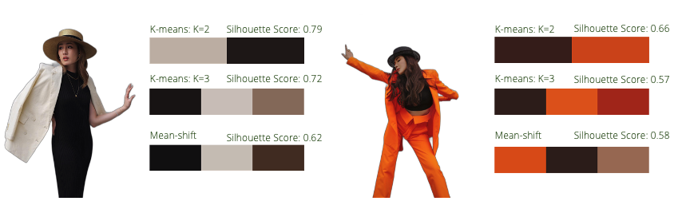
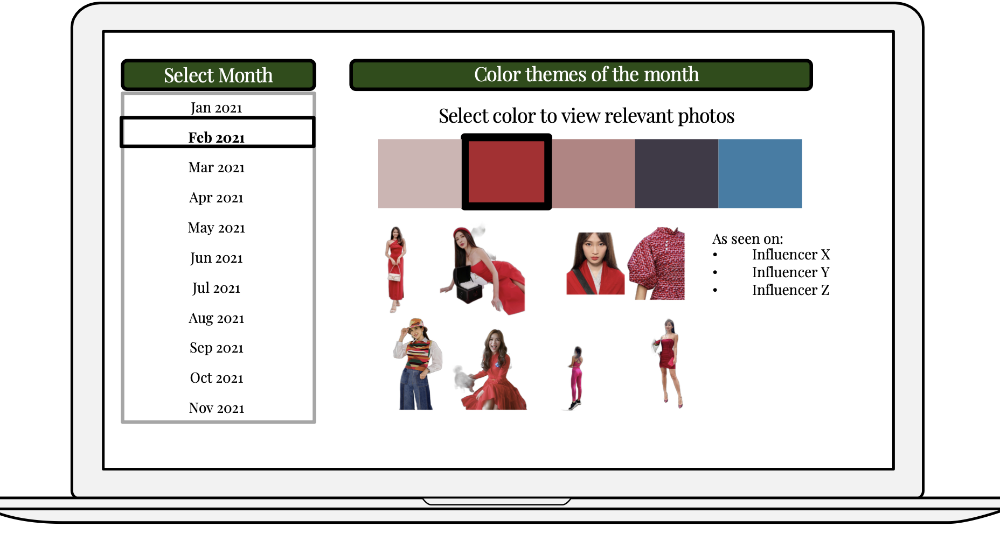

# Spotting Color Trends in Singapore's Fashion Scene through Unsupervised Learning

**Motivation**

Singapore fashion retailers are pressed to keep up with the fast moving trends. Besides materials and cutting, color is also an important aspect to get right. They currently manually scroll through instagram for a sense of the trending colors as one of the reference points, but this is laborious and these information cannot be stored or referred to systematically, making it difficult to really discern trends.
 

**Objective**

Help Singapore fashion retailers systematically spot trending color themes from Instagram photos of top fashion influencers, through unsupervised learning

**Criteria for success:**
* Photos contributing to a cluster make sense (subjective)
* Able to offer new and interesting insights to trending colors (subjective)
* Quality of clusters are good (objective: silhouette scores of >0.3)

**Key Recommendation (more details at the bottom):**
* Will recommend the K-means clustering method to discover color trends, to help Singapore fashion retailers with deciding on the color palette of their future launches

  
## Datasets Used & Data Dictionary
Data on top fashion influencers downloaded from Starngage, an influencer marketing platform  ([*source*](https://starngage.com/app/global/influencer/ranking/singapore/fashion))

|Feature|Type|Dataset|Description|
| :- |---|---|---|
|**handle**|*string*|final_acct_df|instagram account name| 
|**name**|*string*|final_acct_df|name of influencer|
|**topics**|*string*|final_acct_df|topics that influencer posts about|
|**follower_count**|*integer*|final_acct_df|number of followers, as at end Nov 2021|
|**to_exclude_pets_food**|*integer*|final_acct_df|1 if topics include pets/food, 0 if not|

Pictures extracted from instagram are saved in ([*this folder*](https://git.generalassemb.ly/limsmin/capstone/tree/master/Capstone/pictures)), with each subfolder corresponding to an Instagram handle (34 handles in total, from Jan-Nov 2021)

RGBA data extracted from Instagram photos are stored in ([*this folder*](https://github.com/limsmin/capstone_v3/tree/master/Capstone/data/rgba)). Each column represents a photo (with image path as the column name), and each row is a pixel's R, G, B and A value in that order

Each photo's k-means cluster centroids are saved in ([*this folder*](https://github.com/limsmin/capstone_v3/blob/master/Capstone/data/cluster_by_photo.csv))

|Feature|Type|Dataset|Description|
| :- |---|---|---|
|**image_list**|*string*|cluster_by_photo|file path for the image| 
|**rgba_list**|*string*|cluster_by_photo|was originally an array of all the rgba values, but cannot be properly stored in this manner. If you need to read the entire rgba_list again, please open the RGBA data stored in ([*this folder*](https://github.com/limsmin/capstone_v3/tree/master/Capstone/data/rgba))
|**instagram_handle**|*string*|cluster_by_photo|instagram account name|
|**seq_post_samedate**|*integer*|cluster_by_photo|sequence of posted image on the same date|
|**rgba_centers_2**|*string*|cluster_by_photo|RGBA values of the 2 centroids in k-means clustering, where k = 2. To be converted to array when read|
|**rgba_centers_3**|*string*|cluster_by_photo|RGBA values of the 3 centroids in k-means clustering, where k = 3. To be converted to array when read|
|**rgba_centers_4**|*string*|cluster_by_photo|RGBA values of the 4 centroids in k-means clustering, where k = 4. To be converted to array when read|

## Summary of Methodology

**Extraction of photos from Instagram:**
* Top 34 fashion influencers by follower count, as identified by Starngage ([*source*](https://starngage.com/app/global/influencer/ranking/singapore/fashion))
* Used Python library Instaloader ([*source*](https://github.com/instaloader/instaloader)) to extract posts for each of the 34 accounts

**Photo Processing:**
* Step 1: Remove background as it introduces too much noise to identifying the dominant color of clothes. Used Python library rembg ([*source*](https://github.com/danielgatis/rembg))to remove background automatically
* Step 2: Remove irrelevant photos that have no humans inside, or where objects are the bulk of the picture. Currently, this is done manually, but the task is easier after the background removal in Step 1. This will also be a point of follow-up in my next steps
* Step 3: Resize images and extract relevant RGBA data using Python Imaging Library
* Step 4: Save RGBA information in csv. The data needs to be transformed and saved in batches

## Modelling Choice and Results
**Use of Unsupervised Learning:**
* Dealing with a large dataset with unlabelled colors
* Even manually labelling the colors into "groups" can prove to be hard as colors are not that clear-cut, e.g. would maroon be purple or red? would light khaki be yellow or brown?

**Shortlisted Models:**
* Tried on centroid-based models for now, as this would make it easier to obatin cluster centers as a representation of the cluster, which is what I need in my envisioned end product

**Modelling Results:**
* K-means clustering (K=2, 3)gave a mean silhouette score of 0.61, for clustering at individual photos, better than K=4 (0.55) and mean-shift (0.50). Given that scores are similar for 2 or 3 clusters, I have chosen to use 3 clusters to possibly capture more colors

* These identified three centroids for each photo are then clustered for each month, to give a mean silhouette score of 0.50 across the months. The score did not differ much across the use of 3, 5 or 7 clusters, so for the purposes of this project, the user can toggle to use different number of clusters to see if fresh insights can be obtained
* Purpose of clustering on each photo's centroids is so that it is easier to trace back the photos that contributed to a certain cluster at the monthly consolidated level

## Sample Use Case: Investigating color trends in Feb and Nov 2021 to gain inspiration for CNY 2022
* Unsurprisingly, red turned up as a dominant color in Feb 2021, which provides some comfort that the clustering makes sense. Looking at the photos in this cluster, some interesting findings include patterned clothing with different shades of red
* Pink also turned up as a dominant color in Feb 2021, but what is interesting is that it is a muted, soft shade of pink and not the bright shade more commonly associated with CNY. This could point to a trend of choosing softer colors for the occasion
* More surprisingly, a bright bluish-green color appeared as a dominant color (although less so than red/pink) in Feb 2021, which could be a color to consider for next year as well
* Looking at Nov 2021 for more recent trends which may carry over to early next year, we see an orange-red dominant color. Looking at the photos in this cluster, we do see bright and burnt orange tones appearing, which could be an interesting variation to the common red for CNY

## Recommendations
I will recommend the implementation of K-means clustering method as a beta for helping fashion retailers 
* Photos contributing to a cluster make sense (subjective call from the sample use case, but will get more feedback from users once beta is launched)
* Able to offer new and interesting insights to trending colors (subjective call from the sample use case, but will get more feedback from users once beta is launched)
* Quality of clusters are good (objective: silhouette scores of 0.61 for each photo, and 0.50 for each month)

Next Steps:
* In order to filter out irrelevant Instagram photos more systematically, I will explore building a people counter with OpenCV to keep only photos where human count = 1
* Explore object segmentation to detect clothes before doing color clustering, to avoid having skin and hair color in the clusters
* Most importantly, to deploy into a webpage/app for easy access. Envisioned end product below:
